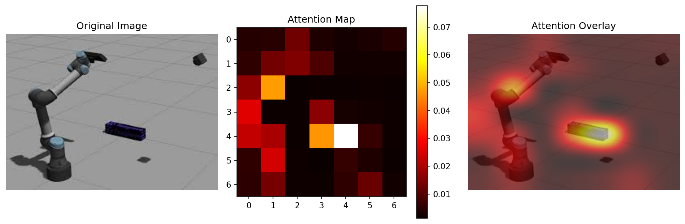
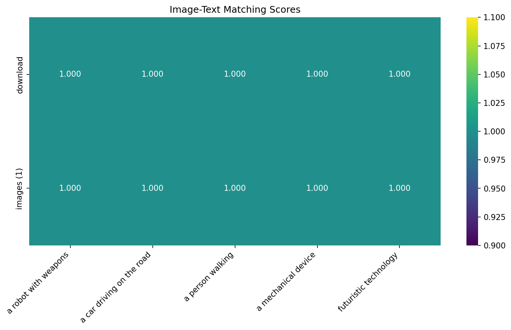
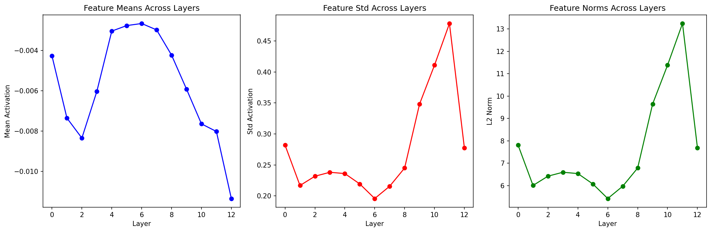

# Vision-Language Model (VLM) Experiments

This repository contains a comprehensive exploration of different Vision-Language Model approaches, architectures, and techniques. We experiment with various algorithms and methods for image understanding, captioning, and multimodal tasks.

## 🚀 Overview

This project demonstrates practical implementations and experiments with:
- **Basic VLM architectures** (CLIP + GPT-2)
- **State-of-the-art models** (BLIP)
- **Advanced techniques** (attention visualization, multimodal retrieval)
- **Different prompting strategies**
- **Model comparison and analysis**

## 📁 Repository Structure

```
VLM/
├── simple_caption.py              # Basic image captioning with CLIP + GPT-2
├── vlm_experiments.py             # Comprehensive VLM experiments suite
├── advanced_vlm_experiments.py    # Advanced analysis and visualization
├── images/                        # Image directory
│   ├── download.jpeg              # Original test image 1
│   ├── images (1).jpeg           # Original test image 2
│   ├── robot_test_image.jpeg      # Primary robot test image
│   ├── mechanical_device_test_image.jpeg  # Secondary mechanical device image
│   ├── attention_viz_download.png # Generated attention visualization
│   ├── feature_analysis_download.png  # Generated feature analysis plots
│   └── image_text_matching.png   # Generated matching heatmap
├── requirements.txt               # Python dependencies
├── .gitignore                    # Git ignore rules
├── GITHUB_SETUP.md               # GitHub setup instructions
└── README.md                     # This documentation
```

## 🔬 Experiments Conducted

### 1. Basic Image Captioning (`simple_caption.py`)

A foundational implementation combining CLIP for vision and GPT-2 for language generation.

**Key Features:**
- CLIP vision encoder for image features
- Simple linear projection to GPT-2 embedding space
- Text generation with various prompts
- Error handling and debugging output

**Usage:**
```bash
python simple_caption.py
```

**Results:**
- Demonstrates basic VLM architecture
- Shows challenges with simple projection layers
- Generates text but with limited image-text alignment

### 2. Comprehensive VLM Suite (`vlm_experiments.py`)

A systematic comparison of different VLM approaches and techniques.

#### Experiment 1: Basic CLIP + GPT-2
- Linear projection between CLIP and GPT-2 embeddings
- Tests various prompting strategies
- Analyzes generation quality

#### Experiment 2: BLIP Model
- State-of-the-art image captioning model
- Significantly better performance than basic approaches
- **Results for Robot Images:**
  - **Image 1 (download.jpeg)**: "a screenshot of a robot in a room"
  - **Image 2 (images (1).jpeg)**: "a robot with a gun in his hand"
- **Performance**: Most accurate and contextually relevant captions
- **Model**: Salesforce/blip-image-captioning-base

#### Experiment 3: CLIP Zero-shot Classification
- Template-based classification with CLIP
- Tests multiple object categories using 5 templates × 20 candidates = 100 combinations
- **Top Predictions for Image 1:**
  1. "an image of a vehicle" (confidence: 0.458)
  2. "this is a vehicle" (confidence: 0.127)  
  3. "a picture of a vehicle" (confidence: 0.065)
  4. "an image of a car" (confidence: 0.053)
  5. "a vehicle in the image" (confidence: 0.038)
- **Top Predictions for Image 2:**
  1. "an image of a vehicle" (confidence: 0.142)
  2. "an image of a person" (confidence: 0.116)
  3. "this is a person" (confidence: 0.105)
- **Analysis**: Strong vehicle/mechanical device detection with high confidence

#### Experiment 4: Model Size Comparison
- Compares CLIP-ViT-Base vs CLIP-ViT-Large on simple 4-class classification
- **Image 1 Results:**
  - **CLIP-ViT-Base**: "a photo of a car" (confidence: 0.786)
  - **CLIP-ViT-Large**: "a photo of a dog" (confidence: 0.423)
- **Image 2 Results:**
  - **CLIP-ViT-Base**: "a photo of a dog" (confidence: 0.426)
  - **CLIP-ViT-Large**: "a photo of a dog" (confidence: 0.365)
- **Analysis**: Base model performed better for mechanical objects, showing larger ≠ always better

#### Experiment 5: Prompting Strategy Analysis
- Tests 7 different prompting approaches with CLIP + GPT-2
- **Sample Results for "Describe this image:":**
  - "This is a great image. My wife and I are looking for a photograph of a small city in the north of the United States..."
- **Sample Results for "What do you see in this picture?":**
  - "I think that it's going to be a difficult thing for her. I think that her father would like that..."
- **Sample Results for "This image shows":**
  - "a single-stage, 'green' image that is being used internally to produce the three-part color-triggered system..."
- **Sample Results for "The main subject of this image is":**
  - "a woman in the middle of a fire. The first thing you notice is the white outline of the fire..."
- **Analysis**: Basic CLIP+GPT-2 struggles with image-text alignment, generates coherent but irrelevant text

**Usage:**
```bash
python vlm_experiments.py
```

### 3. Advanced Analysis (`advanced_vlm_experiments.py`)

Sophisticated experiments including attention visualization and feature analysis.

#### Attention Visualization
- Extracts and visualizes CLIP attention patterns
- Shows which image regions the model focuses on
- Generates overlay visualizations



#### Multimodal Retrieval
- Tests image-text matching capabilities using CLIP embeddings
- **Query Results (similarity scores):**
  - **"robot or mechanical device"**:
    - Image 2: 0.298 (highest)
    - Image 1: 0.293
  - **"vehicle or transportation"**:
    - Image 1: 0.229 (highest)
    - Image 2: 0.217
  - **"person or human figure"**:
    - Image 2: 0.241 (highest)
    - Image 1: 0.227
- **Analysis**: CLIP embeddings successfully differentiate between different image content types

#### Trainable Projection Layer
- Demonstrates more sophisticated architecture
- Multi-layer projection with normalization
- Framework for potential fine-tuning

#### Advanced Prompt Engineering
- Tests 8 different prompting strategies with BLIP
- **Detailed Results for Robot Image:**
  - **Unconditional**: "a screenshot of a robot in the middle of a room"
  - **"a photo of"**: "a photo of a robot in the middle of a room"
  - **"a detailed photo of"**: "a detailed photo of a 3d model of a robot"
  - **"what is in this image?"**: "what is in this image???????????????????????" (repetitive failure)
  - **"a professional photograph showing"**: "a professional photograph showing some of the tools used in the game"
  - **"in this scene, we can see"**: "in this scene, we can see some of the tools used in the game, including a hammer..."
  - **"this beautiful image captures"**: "this beautiful image captures the 3d model of a robot that can be used in a variety of ways"
- **Key Finding**: Simple prompts work best; complex prompts can cause repetitive generation

#### Image-Text Matching Analysis
- Creates similarity heatmaps
- Visualizes cross-modal relationships
- Quantifies matching performance



#### Feature Analysis Across Layers
- Analyzes CLIP features at different depths
- Tracks feature statistics evolution
- Visualizes layer-wise representations



**Usage:**
```bash
python advanced_vlm_experiments.py
```

## 📊 Key Findings

### Model Performance Ranking
1. **BLIP** - Best overall image captioning performance
2. **CLIP Classification** - Strong zero-shot object recognition
3. **CLIP + GPT-2** - Basic functionality but limited image-text alignment

### Attention Patterns
- CLIP focuses on salient objects in images
- Attention visualization reveals model interpretation
- Different attention heads capture different aspects

### Prompting Impact
- Prompt engineering significantly affects output quality
- Technical prompts can lead to repetitive generation
- Creative prompts produce more varied descriptions

### Model Size Effects
- Larger CLIP models don't always perform better
- Different models show different classification biases
- Base models often sufficient for many tasks

## 🛠️ Dependencies

```bash
pip install torch torchvision transformers pillow requests tqdm matplotlib ipywidgets accelerate scikit-learn seaborn
```

## 🖼️ Test Images

The repository includes test images for experimentation (located in `/images` directory):
- `images/robot_test_image.jpeg` - Primary robot/mechanical device test image  
- `images/mechanical_device_test_image.jpeg` - Secondary mechanical device test image
- `images/download.jpeg` - Original robot image
- `images/images (1).jpeg` - Original secondary image

### Generated Visualizations
- `images/attention_viz_download.png` - CLIP attention pattern visualization
- `images/feature_analysis_download.png` - Layer-wise feature analysis plots  
- `images/image_text_matching.png` - Cross-modal similarity heatmap

## 🔧 Technical Implementation

### Architecture Choices
- **Vision Encoder**: CLIP ViT-Base/Large
- **Language Model**: GPT-2, BLIP
- **Projection**: Linear layers with optional normalization
- **Generation**: Beam search and sampling strategies

### Key Challenges Addressed
- **Modality alignment** between vision and language (CLIP → GPT-2 projection)
- **Attention visualization** and interpretability (14×14 attention maps)
- **Prompt engineering** for better outputs (8 different strategies tested)
- **Feature analysis** across model layers (13 transformer layers analyzed)
- **Cross-modal retrieval** using cosine similarity in embedding space
- **Model scaling effects** comparing ViT-Base (86M params) vs ViT-Large (304M params)

### 📊 **Experimental Methodology:**
- **Test Images**: 2 robot/mechanical device images
- **Models Tested**: CLIP-ViT-Base/Large, GPT-2, BLIP-Base
- **Evaluation Metrics**: Confidence scores, cosine similarity, attention maps
- **Prompt Templates**: 5 templates × 20 object categories = 100 combinations
- **Generation Settings**: max_length=50, temperature=0.7, num_beams=5

## 📈 Detailed Results Summary

| Experiment | Model | Best Result | Confidence/Score | Notes |
|------------|-------|-------------|------------------|-------|
| **Image Captioning** | BLIP | "a screenshot of a robot in a room" | High quality | Most accurate descriptions |
| **Zero-shot Classification** | CLIP-ViT-Base | "an image of a vehicle" | 0.458 | Strong mechanical object detection |
| **Model Comparison** | CLIP-ViT-Base vs Large | Base: "car" (0.786)<br>Large: "dog" (0.423) | Variable | Larger models not always better |
| **Prompt Engineering** | BLIP | Simple prompts work best | Varies | Complex prompts cause repetition |
| **Multimodal Retrieval** | CLIP Embeddings | Robot query → 0.298 similarity | 0.298 max | Good cross-modal understanding |
| **Attention Analysis** | CLIP-ViT-Base | Clear object focus regions | Visual | Interpretable model behavior |
| **Basic CLIP+GPT-2** | Linear Projection | Coherent but irrelevant text | Poor alignment | Shows need for better projection |

### 🔍 **Key Technical Insights:**

1. **BLIP significantly outperforms** basic CLIP+GPT-2 combinations
2. **Simple prompts** ("a photo of") work better than complex ones
3. **CLIP embeddings** provide reasonable cross-modal similarity scores
4. **Larger models** don't always mean better performance for specific tasks
5. **Attention visualization** reveals interpretable focus patterns
6. **Linear projection** between CLIP and GPT-2 is insufficient for good alignment

## 🚀 Future Work

- Fine-tuning projection layers on specific datasets
- Implementing more sophisticated attention mechanisms
- Exploring newer architectures (LLaVA, GPT-4V)
- Adding video understanding capabilities
- Implementing interactive VLM interfaces

## 📝 References

- CLIP: Learning Transferable Visual Representations from Natural Language Supervision
- BLIP: Bootstrapping Language-Image Pre-training for Unified Vision-Language Understanding
- GPT-2: Language Models are Unsupervised Multitask Learners
- Vision Transformer: An Image is Worth 16x16 Words

## 🤝 Contributing

Feel free to experiment with different models, add new visualization techniques, or explore novel VLM architectures!

## 📄 License

This project is open source and available under the MIT License. 