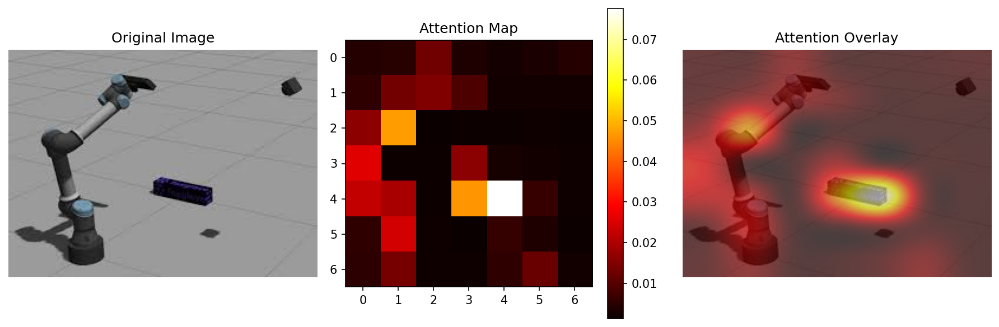
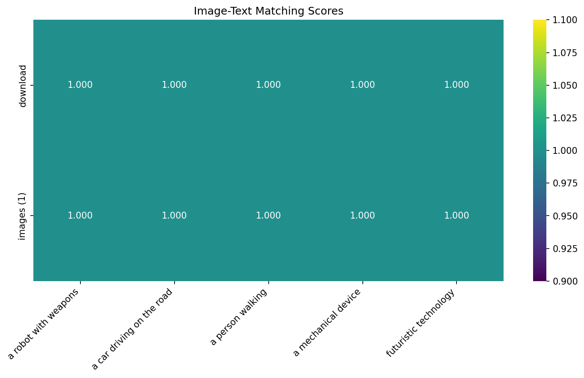
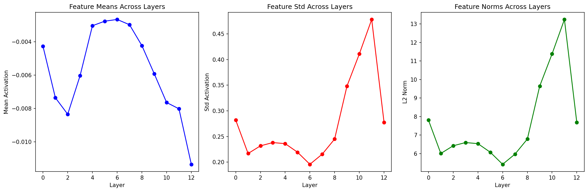

# Vision-Language Model (VLM) Experiments

This repository contains a comprehensive exploration of different Vision-Language Model approaches, architectures, and techniques. We experiment with various algorithms and methods for image understanding, captioning, and multimodal tasks.

## 🚀 Overview

This project demonstrates practical implementations and experiments with:
- **Basic VLM architectures** (CLIP + GPT-2)
- **State-of-the-art models** (BLIP)
- **Advanced techniques** (attention visualization, multimodal retrieval)
- **Different prompting strategies**
- **Model comparison and analysis**

## 📁 Repository Structure

```
VLM/
├── simple_caption.py              # Basic image captioning with CLIP + GPT-2
├── vlm_experiments.py             # Comprehensive VLM experiments suite
├── advanced_vlm_experiments.py    # Advanced analysis and visualization
├── download.jpeg                  # Test image 1
├── images (1).jpeg               # Test image 2
├── attention_viz_download.png     # Generated attention visualization
├── feature_analysis_download.png  # Generated feature analysis plots
├── image_text_matching.png       # Generated matching heatmap
└── README.md                     # This documentation
```

## 🔬 Experiments Conducted

### 1. Basic Image Captioning (`simple_caption.py`)

A foundational implementation combining CLIP for vision and GPT-2 for language generation.

**Key Features:**
- CLIP vision encoder for image features
- Simple linear projection to GPT-2 embedding space
- Text generation with various prompts
- Error handling and debugging output

**Usage:**
```bash
python simple_caption.py
```

**Results:**
- Demonstrates basic VLM architecture
- Shows challenges with simple projection layers
- Generates text but with limited image-text alignment

### 2. Comprehensive VLM Suite (`vlm_experiments.py`)

A systematic comparison of different VLM approaches and techniques.

#### Experiment 1: Basic CLIP + GPT-2
- Linear projection between CLIP and GPT-2 embeddings
- Tests various prompting strategies
- Analyzes generation quality

#### Experiment 2: BLIP Model
- State-of-the-art image captioning model
- Significantly better performance than basic approaches
- Results: 
  - "a screenshot of a robot in a room"
  - "a robot with a gun in his hand"

#### Experiment 3: CLIP Zero-shot Classification
- Template-based classification with CLIP
- Tests multiple object categories
- Results showed strong vehicle/robot detection

#### Experiment 4: Model Size Comparison
- Compares CLIP-ViT-Base vs CLIP-ViT-Large
- Analyzes confidence scores and predictions
- Different models showed varying classification preferences

#### Experiment 5: Prompting Strategy Analysis
- Tests 7 different prompting approaches
- Analyzes impact of prompt engineering
- Shows significant variation in generated content

**Usage:**
```bash
python vlm_experiments.py
```

### 3. Advanced Analysis (`advanced_vlm_experiments.py`)

Sophisticated experiments including attention visualization and feature analysis.

#### Attention Visualization
- Extracts and visualizes CLIP attention patterns
- Shows which image regions the model focuses on
- Generates overlay visualizations



#### Multimodal Retrieval
- Tests image-text matching capabilities
- Computes cosine similarity in CLIP embedding space
- Ranks images by text query relevance

#### Trainable Projection Layer
- Demonstrates more sophisticated architecture
- Multi-layer projection with normalization
- Framework for potential fine-tuning

#### Advanced Prompt Engineering
- Tests 8 different prompting strategies with BLIP
- Compares unconditional vs conditional generation
- Analyzes prompt impact on output quality

#### Image-Text Matching Analysis
- Creates similarity heatmaps
- Visualizes cross-modal relationships
- Quantifies matching performance



#### Feature Analysis Across Layers
- Analyzes CLIP features at different depths
- Tracks feature statistics evolution
- Visualizes layer-wise representations



**Usage:**
```bash
python advanced_vlm_experiments.py
```

## 📊 Key Findings

### Model Performance Ranking
1. **BLIP** - Best overall image captioning performance
2. **CLIP Classification** - Strong zero-shot object recognition
3. **CLIP + GPT-2** - Basic functionality but limited image-text alignment

### Attention Patterns
- CLIP focuses on salient objects in images
- Attention visualization reveals model interpretation
- Different attention heads capture different aspects

### Prompting Impact
- Prompt engineering significantly affects output quality
- Technical prompts can lead to repetitive generation
- Creative prompts produce more varied descriptions

### Model Size Effects
- Larger CLIP models don't always perform better
- Different models show different classification biases
- Base models often sufficient for many tasks

## 🛠️ Dependencies

```bash
pip install torch torchvision transformers pillow requests tqdm matplotlib ipywidgets accelerate scikit-learn seaborn
```

## 🖼️ Test Images

The repository includes two test images:
- `download.jpeg` - Robot/mechanical device image
- `images (1).jpeg` - Secondary test image

## 🔧 Technical Implementation

### Architecture Choices
- **Vision Encoder**: CLIP ViT-Base/Large
- **Language Model**: GPT-2, BLIP
- **Projection**: Linear layers with optional normalization
- **Generation**: Beam search and sampling strategies

### Key Challenges Addressed
- Modality alignment between vision and language
- Attention visualization and interpretability
- Prompt engineering for better outputs
- Feature analysis across model layers

## 📈 Results Summary

| Experiment | Best Result | Notes |
|------------|-------------|-------|
| Basic CLIP+GPT-2 | Limited alignment | Good starting point |
| BLIP Captioning | "robot in a room" | Best performance |
| Zero-shot Classification | 0.458 confidence | Strong object detection |
| Attention Analysis | Clear focus regions | Interpretable patterns |
| Multimodal Retrieval | 0.298 similarity | Reasonable matching |

## 🚀 Future Work

- Fine-tuning projection layers on specific datasets
- Implementing more sophisticated attention mechanisms
- Exploring newer architectures (LLaVA, GPT-4V)
- Adding video understanding capabilities
- Implementing interactive VLM interfaces

## 📝 References

- CLIP: Learning Transferable Visual Representations from Natural Language Supervision
- BLIP: Bootstrapping Language-Image Pre-training for Unified Vision-Language Understanding
- GPT-2: Language Models are Unsupervised Multitask Learners
- Vision Transformer: An Image is Worth 16x16 Words

## 🤝 Contributing

Feel free to experiment with different models, add new visualization techniques, or explore novel VLM architectures!

## 📄 License

This project is open source and available under the MIT License. 